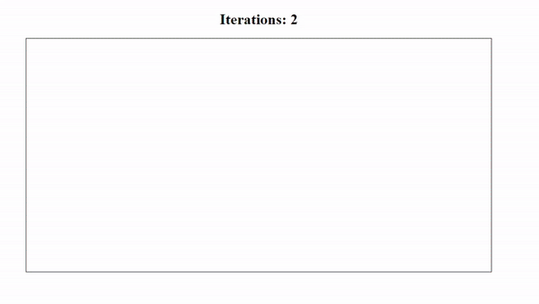
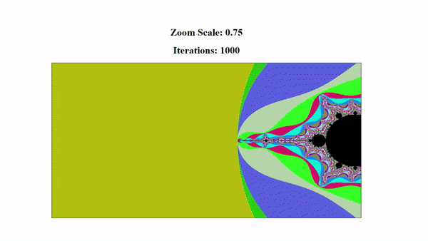

# HTML Mandelbrot
A simple implementation of the mandelbrot set written using the canvas component in HTML5.

Only the standard 2D rendering context is used in this example. This renderer is a fundamentally CPU bound and as such is highly inefficient.

This was chosen over a hardware accelerated alternative both to examine the limitations of the basic renderer and for ease of implementation.

# Details
The Mandelbrot set is the set of complex numbers that do not trend towards infinity when iteratively applied to the function *`f(z) = (z*z) + c`* where z is any real number starting at zero and iterating to some chosen number and c is the chosen complex number *`a + bi`*.

If the real and imaginary components of the complex number are treated as normalized coordinates and the function is iterated with progressive numbers of z the function will either expand towards infinity or remain within the chosen bounds.

As higher iterations are used for the z value, finer detail of the shape of the set becomes visible.

The sets colors are selected randomly and assigned based on the number of iterations taken to converge towards the maximum values.

All values that do not trend towards infinity within the iteration count are colored black.

The resulting shape is a fractal with finite area and infinte perimeter that is perfectly self similar at increasing zoom levels.

---